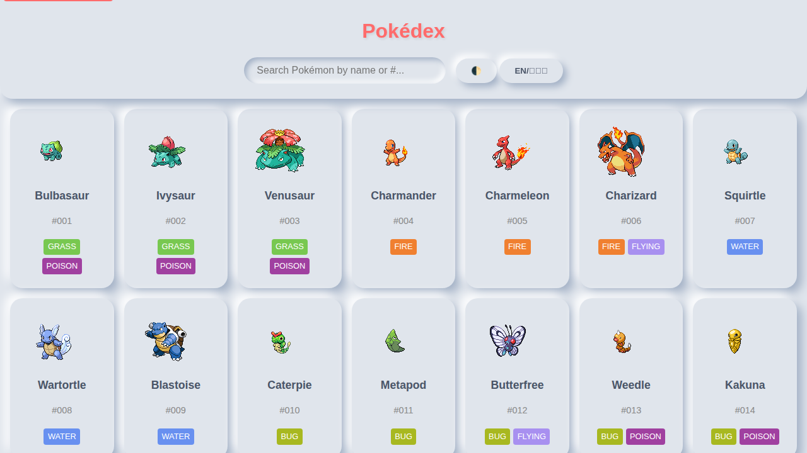

# Pokédex

An interactive web application showcasing all 1025 Pokémon (Generations I-IX) with detailed information, bilingual support, and modern accessibility features.

**Live Demo:** [www.pokedex.tech](https://www.pokedex.tech)

---

## 🤝 We Welcome Contributors!

This project thrives on community contributions! Whether you're fixing bugs, adding features, improving documentation, or testing across different environments, your help is valued and appreciated.

**New to open source?** This is a great project to start with! We have issues labeled for beginners and comprehensive documentation to help you get started.

👉 **[See CONTRIBUTING.md](CONTRIBUTING.md) for detailed guidelines**

## Screenshots

### Main Interface


### Pokemon Details


## Features

### Core Features
- 🎮 **Complete Pokédex**: All 1025 Pokémon (Generations I-IX) with comprehensive information
- 📖 **Detailed Pokémon Info**: View physical stats (category, height, weight), abilities, sprites (including shinies), stats with comparison indicators, type effectiveness, learnable moves, and evolution chains
- 🔊 **Authentic Cries**: Pokémon cries for authentic experience
- 🌍 **Bilingual Support**: Full English/Japanese language toggle with romaji
- 🎨 **Theme Support**: Light and dark theme toggle with persistent preferences
- 🔍 **Advanced Search**: Search by name, ID, or type with real-time filtering
- 📊 **Sorting Options**: Sort by ID, name, height, weight, or stats
- ♿ **Accessibility**: Full keyboard navigation and screen reader support
- 📱 **Responsive Design**: Optimized for all devices (mobile, tablet, desktop)

### Advanced Features
- ⚔️ **Pokémon Comparison**: Side-by-side comparison of stats, types, and abilities (compare up to 3 Pokémon)
- 👥 **Team Builder**: Build and manage teams of up to 6 Pokémon with type coverage analysis
- 🔗 **URL Routing**: Deep linking support with shareable URLs for specific Pokémon
- 🔄 **Evolution Chains**: Interactive evolution trees with branching paths and evolution methods
- 📈 **Type Effectiveness**: Visual weaknesses and resistances for each Pokémon type
- 🎯 **Move Details**: Complete learnable moves with power, accuracy, and damage class
- 🔍 **SEO Optimized**: Structured data for search engine indexing and rich snippets
- 💾 **Offline Support**: Progressive Web App with service worker caching
- ⌨️ **Keyboard Shortcuts**: Full keyboard navigation (press '?' for help)

## Quick Start

```bash
# Clone the repository
git clone https://github.com/kiefertaylorland/pokedex.git
cd pokedex

# Start local server
python3 -m http.server 8000

# Open in browser
# http://localhost:8000
```

## Development

**Install dependencies:**
```bash
pip install -r requirements.txt
```

**Run tests:**
```bash
python run_tests.py

# Run with coverage reporting
make coverage

# See KNOWN_TEST_FAILURES.md for environment-specific test issues
```

**Regenerate data from PokéAPI:**
```bash
python pokeapi_fetch.py
```
This will fetch data for all 1025 Pokémon (Generations I-IX) from the PokeAPI, including their stats, types, moves, evolution chains, and cries.

## Technology Stack

- **Frontend**: HTML5, CSS3, JavaScript (ES6 modules) - No frameworks, just vanilla JS!
- **Data Source**: [PokéAPI](https://pokeapi.co/)
- **Backend**: Python 3.12+ for data processing and testing
- **Testing**: pytest + Selenium WebDriver
- **Deployment**: GitHub Pages with GitHub Actions CI/CD

## 🌟 Contributing

We'd love your help making this Pokédex even better! Here are some ways you can contribute:

### For Developers
- 🐛 **Fix bugs** - Check out our [issues](https://github.com/kiefertaylorland/pokedex/issues) (45+ tracked opportunities!)
- ✨ **Add features** - Evolution animations, type filtering improvements, performance optimizations
- 🎨 **Improve UI/UX** - Better mobile experience, accessibility enhancements, theme improvements
- ♿ **Accessibility** - Help us make the app work perfectly with screen readers and keyboard navigation
- 🌐 **Internationalization** - Add support for more languages beyond English/Japanese

### For Testers
- 🧪 **Test on different devices** - Mobile phones, tablets, different browsers
- 📝 **Report bugs** - Found something broken? Let us know!
- 🔍 **Review PRs** - Help review code from other contributors
- 📚 **Improve documentation** - Fix typos, clarify instructions, add examples

### For Designers
- 🎨 **Design improvements** - Better card layouts, improved type badges, animation concepts
- 📱 **Mobile optimization** - Help make the mobile experience even smoother
- 🌈 **Theme variations** - Additional color schemes, seasonal themes

### Getting Started

1. **Read the [Contributing Guide](CONTRIBUTING.md)** - Comprehensive setup and style guide
2. **Check [issues.md](issues.md)** - 45+ documented improvement opportunities
3. **Review [.github/copilot-instructions.md](.github/copilot-instructions.md)** - Architecture deep dive
4. **Start small** - Pick a good first issue and submit a PR!

**Quick Setup:**
```bash
git clone https://github.com/kiefertaylorland/pokedex.git
cd pokedex
pip install -r requirements.txt
python3 -m http.server 8000
# Open http://localhost:8000 and start coding!
```

### Community Guidelines

- 💬 **Be respectful and inclusive** - We're all here to learn and have fun
- 🤔 **Ask questions** - No question is too small
- 🎓 **Help others** - Share your knowledge with newer contributors
- 🎉 **Celebrate wins** - Every contribution matters, big or small

## 📬 Get in Touch

- 🐛 **Report bugs**: [Open an issue](https://github.com/kiefertaylorland/pokedex/issues/new)
- 💡 **Suggest features**: [Open an issue](https://github.com/kiefertaylorland/pokedex/issues/new) with your idea
- 🔀 **Submit code**: [Open a pull request](https://github.com/kiefertaylorland/pokedex/pulls)

## License

This project is not currently licensed. Feel free to use for personal projects.

---

**Built with ❤️ by the open source community**
