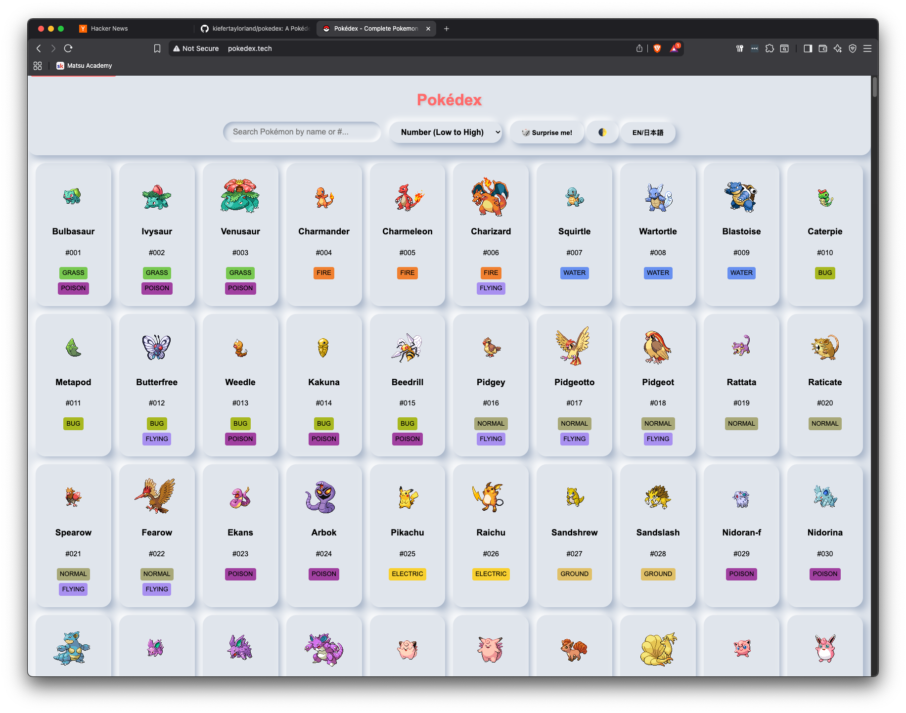
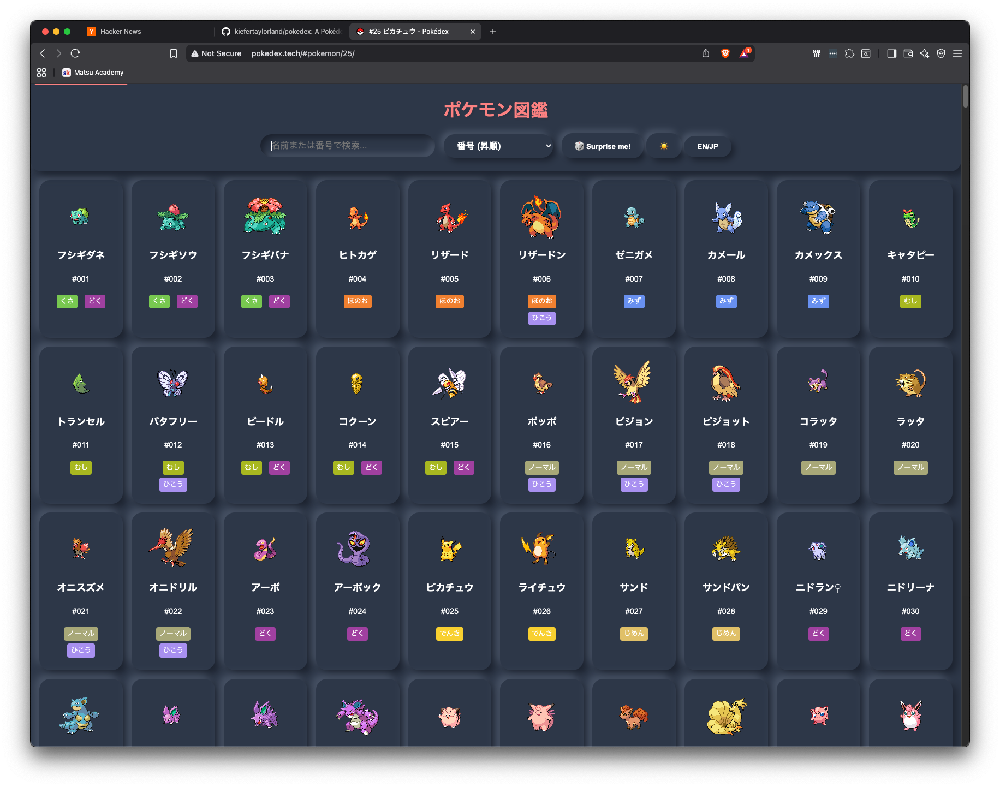
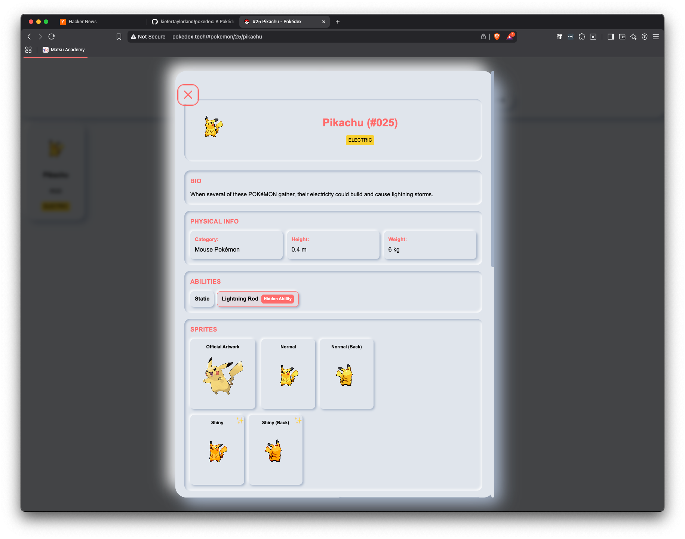
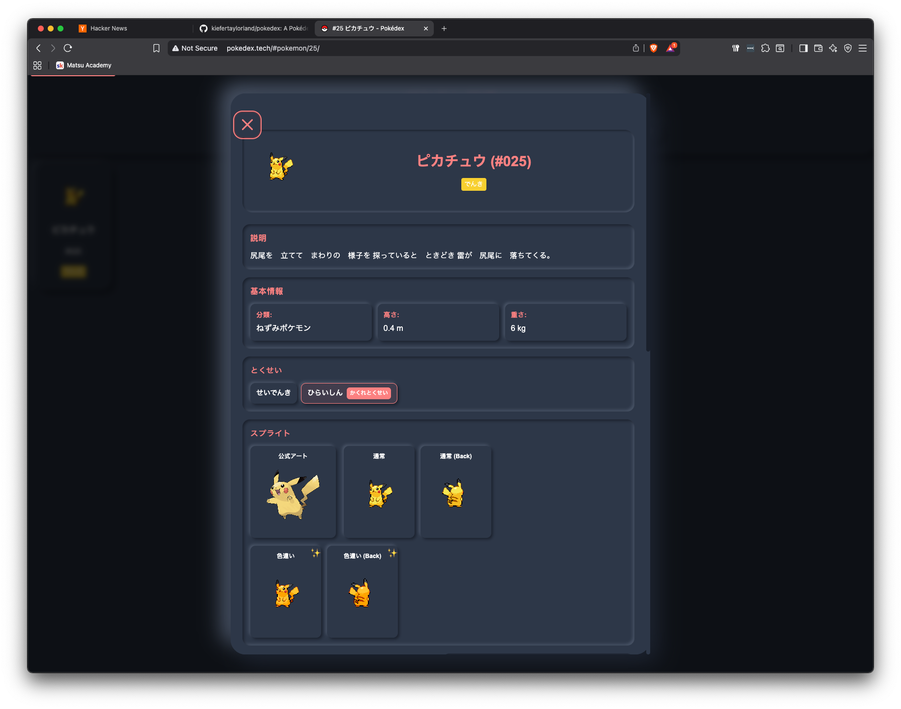

# Pokédex

An interactive web application showcasing all 1025 Pokémon (Generations I-IX) with detailed information, bilingual support, and modern accessibility features.

**Live Demo:** [www.pokedex.tech](https://www.pokedex.tech)

## Screenshots

### Main Interface




### Pokemon Details




## Features

### Core Features
- 🎮 **Complete Pokédex**: All 1025 Pokémon (Generations I-IX) with comprehensive information
- 📖 **Detailed Pokémon Info**: View physical stats (category, height, weight), abilities, sprites (including shinies), stats with comparison indicators, type effectiveness, learnable moves, and evolution chains
- 🔊 **Authentic Cries**: Pokémon cries for authentic experience
- 🌍 **Bilingual Support**: Full English/Japanese language toggle with romaji
- 🎨 **Theme Support**: Light and dark theme toggle with persistent preferences
- 🔍 **Advanced Search**: Search by name, ID, or type with real-time filtering
- 📊 **Sorting Options**: Sort by ID, name, height, weight, or stats
- ♿ **Accessibility**: Full keyboard navigation and screen reader support
- 📱 **Responsive Design**: Optimized for all devices (mobile, tablet, desktop)

### Advanced Features
- ⚔️ **Pokémon Comparison**: Side-by-side comparison of stats, types, and abilities (compare up to 3 Pokémon)
- 👥 **Team Builder**: Build and manage teams of up to 6 Pokémon with type coverage analysis
- 🔗 **URL Routing**: Deep linking support with shareable URLs for specific Pokémon
- 🔄 **Evolution Chains**: Interactive evolution trees with branching paths and evolution methods
- 📈 **Type Effectiveness**: Visual weaknesses and resistances for each Pokémon type
- 🎯 **Move Details**: Complete learnable moves with power, accuracy, and damage class
- 🔍 **SEO Optimized**: Structured data for search engine indexing and rich snippets
- 💾 **Offline Support**: Progressive Web App with service worker caching
- ⌨️ **Keyboard Shortcuts**: Full keyboard navigation (press '?' for help)

## Quick Start

```bash
# Clone the repository
git clone https://github.com/kiefertaylorland/pokedex.git
cd pokedex

# Start local server
python3 -m http.server 8000

# Open in browser
# http://localhost:8000
```

## Development

**Install dependencies:**
```bash
pip install -r requirements.txt
```

**Run tests:**
```bash
python run_tests.py

# Run with coverage reporting
make coverage

# See KNOWN_TEST_FAILURES.md for environment-specific test issues
```

**Regenerate data from PokéAPI:**
```bash
python pokeapi_fetch.py
```
This will fetch data for all 1025 Pokémon (Generations I-IX) from the PokeAPI, including their stats, types, moves, evolution chains, and cries.

## Technology Stack

- **Frontend**: HTML5, CSS3, JavaScript (ES6 modules)
- **Data Source**: [PokéAPI](https://pokeapi.co/)
- **Backend/Testing**: Python 3.12+ with Selenium
- **Deployment**: GitHub Pages (static site, no build step)
- **Architecture**: Event-driven components with service worker PWA support

## Contributing

**We'd love your help making this Pokédex even better!** 🎉

Whether you're a seasoned developer or just starting out, there are plenty of ways to contribute:

### For Developers 👩‍💻👨‍💻

- **Bug Fixes**: Found something broken? We have [45 tracked issues](issues.md) ready to tackle
- **New Features**: Want to add animations, performance improvements, or new Pokémon features?
- **Refactoring**: Help clean up our [1200+ line detail view component](assets/js/components/pokemonDetailView.js)
- **Accessibility**: Improve keyboard navigation, screen reader support, or ARIA labels
- **Internationalization**: Add more languages beyond English/Japanese

**Quick Start for Contributors:**
```bash
git clone https://github.com/kiefertaylorland/pokedex.git
cd pokedex
pip install -r requirements.txt
python3 -m http.server 8000
# Visit http://localhost:8000 and start coding!
```

**Good First Issues:**
- Lazy loading for 1025 Pokémon cards (Issue #25)
- Remove debug console.log statements (Issue #7)
- Add loading skeletons for better UX
- Improve mobile responsiveness
- Add more keyboard shortcuts

### For Testers 🧪

- **Cross-Browser Testing**: Test on Safari, Firefox, Edge, or mobile browsers
- **Accessibility Testing**: Use screen readers (NVDA, JAWS, VoiceOver)
- **Performance Testing**: Test with slow connections or older devices
- **Localization Testing**: Verify Japanese translations and romaji accuracy
- **Report Bugs**: Found an issue? [Open a detailed bug report](https://github.com/kiefertaylorland/pokedex/issues/new)

**Running Tests:**
```bash
python run_tests.py  # Automated Selenium tests
# See KNOWN_TEST_FAILURES.md for environment-specific issues
```

### For Designers 🎨

- **UI/UX Improvements**: Suggest better layouts or interactions
- **Theme Enhancements**: Improve light/dark theme colors
- **Animations**: Add delightful micro-interactions
- **Icons**: Create custom icons or improve existing ones

### Contributing Guidelines

1. **Read** [CONTRIBUTING.md](CONTRIBUTING.md) for detailed guidelines
2. **Check** [issues.md](issues.md) for known issues and TODOs
3. **Follow** our code style (camelCase JS, snake_case Python, semantic HTML)
4. **Test** your changes (works in light/dark themes, both languages)
5. **Document** your code (JSDoc comments, update README if needed)

**All skill levels welcome!** Don't be intimidated—we're here to help you learn and grow. Feel free to ask questions in issues or pull requests.

📖 **New to open source?** Check out [How to Contribute to Open Source](https://opensource.guide/how-to-contribute/)

## Community & Support

- **Issues**: [Report bugs or request features](https://github.com/kiefertaylorland/pokedex/issues)
- **Discussions**: Share ideas or ask questions
- **Pull Requests**: [Submit your contributions](https://github.com/kiefertaylorland/pokedex/pulls)

## License

This project is not currently licensed. Feel free to use for personal projects.
